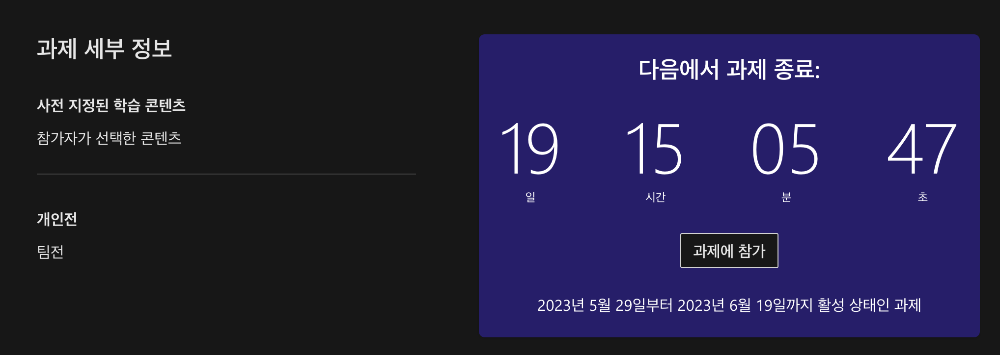

# 클라우드 스킬 챌린지 참가,완주,인증 요령
안녕하세요  
해커그라운드 조직위원회입니다

클라우드 스킬 챌린지 신청해 주신 분들께 감사 인사드립니다.  
진행하시는데 도움을 드리고자 합니다.  

## 클라우드 스킬 챌린지 참가요령
6가지 토픽 중 각자 이수하려는 과목이 있으실텐데 아래 링크를 통해 로그인 후 신청하시면 됩니다.

### 클라우드 스킬 챌린지 6가지 토픽
1. *Hackers Ground: 애저 기초 (AZ-900) 챌린지*- 👉 [챌린지 바로가기](https://aka.ms/hg/csc/az-900)
1. *Hackers Ground: 애저 AI 기초 (AI-900) 챌린지*- 👉 [챌린지 바로가기](https://aka.ms/hg/csc/ai-900)
1. *Hackers Ground: 애저 데이터 기초 (DP-900) 챌린지*- 👉 [챌린지 바로가기](https://aka.ms/hg/csc/dp-900)
1. *Hackers Ground: 파워 플랫폼 기초 (PL-900) 챌린지*- 👉 [챌린지 바로가기](https://aka.ms/hg/csc/pl-900)
1. *Hackers Ground: 보안 기초 (SC-900) 챌린지*- 👉 [챌린지 바로가기](https://aka.ms/hg/csc/sc-900)
1. *Hackers Ground: Microsoft 365 기초 (MS-900) 챌린지*- 👉 [챌린지 바로가기](https://aka.ms/hg/csc/ms-900)

### 챌린지 참가 방법
링크에 들어가 아래 캡처화면 오른쪽에 보이는 “과제에 참가” 버튼을 클릭하면 완료!

### 챌린지 완주요령
챌린지를 신청해 교육을 이수할 때 엣지 브라우저를 활용해 진행하시는 걸 추천해 드립니다. (크롬 브라우저에서 진도 체크가 제대로 안 되는 버그를 파악했습니다.)   
[엣지 브라우저 다운로드](https://www.microsoft.com/ko-kr/edge/download?form=MA13FJ)

진도 체크를 위해 확인할 2가지가 있습니다.
녹색 경험치 박스와 하늘색 계속 버튼입니다.
아래 예시를 확인해 주세요

1. 오른쪽 상단의 경험치 박스가 초록색으로 바뀌어야 정상적으로 인식된 상황입니다.

2. 경험치 박스가 변경되면 문서 하단에 하늘색 계속 버튼이 활성화 됩니다.

### 챌린지 완료인증 
6가지 챌린지 중 토픽을 하나씩 완료하시면 [깃헙 레포](https://github.com/microsoft/hackers-ground/issues)에 아래 정보를 포함해 이슈를 작성해 주세요. 조직위원회에서 확인할 예정입니다.

1가지 토픽을 완료하면 이슈 1개를 작성하고 6가지 토픽을 완료하면 이슈 6개를 작성합니다. 예를 들면, AZ-900을 완료하면 관련해 이슈 1개를 작성하게 되겠죠

1. 깃헙 ID깃헙 프로필에서 가지고 올 수 있습니다. https://github.com/{{깃헙 ID}} 
2. Microsoft Learn 프로필 링크Microsoft Learn 프로필에서 가지고 올 수 있습니다. 예시: https://learn.microsoft.com/ko-kr/users/53042470/
3. 클라우드 스킬 챌린지 토픽애저 기초 (AZ-900), 애저 AI 기초 (AI-900) 등 여러분이 완료한 토픽을 작성해 주세요!

위 3가지 정보를 담아 [깃헙 이슈](https://github.com/microsoft/hackers-ground/issues)를 작성하시면 조직위원회에서 확인할 예정입니다.

### QnA
궁금한 부분은 [디스코드](https://discord.gg/RPUbmXwgYW)로 문의하세요!
