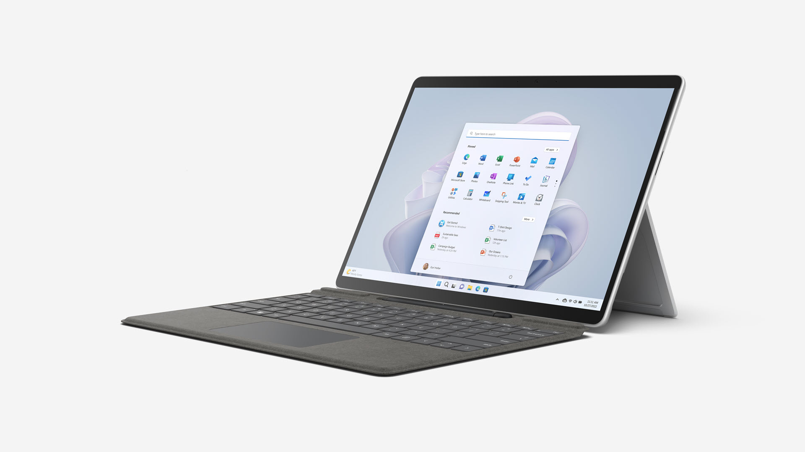
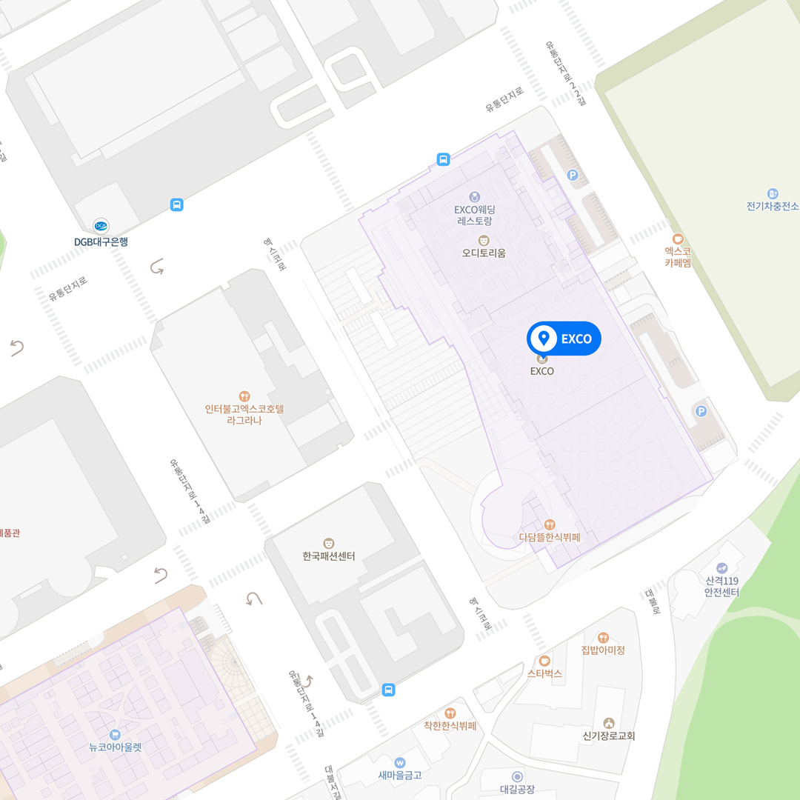

👉 **[For English](./README.en.md)*- 👈

# 해커런 &ndash; 해커그라운드

  

**해커그라운드**는 대구/경북 지역의 청년 개발자들과 함께 [Microsoft 애저 클라우드](https://azure.microsoft.com/ko-kr?WT.mc_id=dotnet-91712-juyoo)를 활용해 당면한 지역의 현안 문제를 해결하는 해커톤입니다.

**해커그라운드 클라우드 스킬 챌린지**는 주어진 기간 안에 관련 지식을 직접 배워서 해커톤에 적용하는 이벤트입니다. 이번 챌린지의 주제는 바로 6대 Microsoft 기초 과정입니다. 3주간 각자 공부하고 해커그라운드 해커톤에 참여해서 직접 서비스를 만들어 보는 해커그라운드 클라우드 스킬 챌린지 이벤트! 도전해 보세요. 푸짐한 상품이 기다립니다!

## 🏅 해커그라운드 클라우드 스킬 챌린지 수상자

모든 챌린지 완료자 중 추첨을 통해 상품

## ⏰ 해커그라운드 클라우드 스킬 챌린지 일정

- 참가 신청기간: 2023년 5월 29일 0시 - 2023년 6월 19일 0시
- 결과제출 마감기한: 2023년 6월 19일 0시
- 수상자 발표: 2023년 6월 20일 18시

## 🙆🏻‍♀️ 해커그라운드 클라우드 스킬 챌린지 참여 자격

- 참여하고 싶은 누구나 가능합니다! 단...
  - 대한민국 소재 17세 ~ 39세 청년이어야 합니다!
  - 행사 기간 중 요청시 자신의 거주지를 증빙할 수 있어야 합니다.

## 🏃🏻‍♂️ 해커그라운드 클라우드 스킬 챌린지 참여 방법

1. 해커그라운드 클라우드 스킬 챌린지 이벤트에 참가 신청합니다.
1. 총 6개의 챌린지 미션을 모두 완료합니다.
1. 각 챌린지 미션을 완료할 때 마다 이슈를 생성하여 운영진에게 [제출][submit]합니다.
1. 챌린지 도중 궁금한 사항이 있을 땐 언제든 [질문/답변][qna] 방을 이용해 주세요.

## 🏆 해커그라운드 클라우드 스킬 챌린지 상품

- 챌린지 미션 두 개 완료할 때 마다 Microsoft 자격증 시험 무료 바우처 제공 👉 최대 3개 바우처 수령 가능
- 모든 챌린지 완료자 중 추첨해서 아래 상품 제공
  - 상품: Microsoft Surface Pro

    

- 자격증 시험 합격시 추가 상품 제공 (추후 공지)

> 상품 관련 세부 사항은 예고 없이 달라질 수 있습니다.

## ✅ 해커그라운드 클라우드 스킬 챌린지 미션

총 **여섯 가지 챌린지 미션**을 완료해야 합니다. 전체 챌린지 미션은 아래와 같습니다.

> 각 챌린지 별로 각각 참가 신청해야 합니다.

1. **Hackers Ground: 애저 기초 (AZ-900) 챌린지*- 👉 [챌린지 바로가기](https://aka.ms/hg/csc/az-900)
1. **Hackers Ground: 애저 AI 기초 (AI-900) 챌린지*- 👉 [챌린지 바로가기](https://aka.ms/hg/csc/ai-900)
1. **Hackers Ground: 애저 데이터 기초 (DP-900) 챌린지*- 👉 [챌린지 바로가기](https://aka.ms/hg/csc/dp-900)
1. **Hackers Ground: 파워 플랫폼 기초 (PL-900) 챌린지*- 👉 [챌린지 바로가기](https://aka.ms/hg/csc/pl-900)
1. **Hackers Ground: 보안 기초 (SC-900) 챌린지*- 👉 [챌린지 바로가기](https://aka.ms/hg/csc/sc-900)
1. **Hackers Ground: Microsoft 365 기초 (MS-900) 챌린지*- 👉 [챌린지 바로가기](https://aka.ms/hg/csc/ms-900)

## 📋 해커그라운드 클라우드 스킬 챌린지 자격증 시험

- 온라인으로 집에서 편히 자격증 시험에 응시할 수 있습니다.
- 집에서 자격증 시험을 치르기 곤란한 경우 아래 링크를 통해 별도의 시험 장소를 예약한 후 응시하세요.
  - 자격증 시험 신청 링크 👉 [준비중]

---

## ⏰ 해커그라운드 해커톤 일정 및 장소

- 참가 신청기간: 2023년 5월 29일 - 2023년 6월 19일
- 사전 핸즈온랩 기간: 2023년 6월 20일
- 해커톤 기간: 2023년 6월 21일 - 23일
- 장소: 대구 엑스코 그랜드볼룸 B (대구광역시 북구 엑스코로 10)

  

## 🙆🏻‍♀️ 해커그라운드 해커톤 참여 자격 및 조건

- 자신이 직접 지역사회 문제 및 현안을 해결하고 싶은 대구/경북 소재 17세 ~ 39세 청년
  - 행사 기간 중 요청시 자신의 거주지를 증명할 수 있어야 합니다.
- [Microsoft 애저 클라우드](https://azure.microsoft.com/ko-kr?WT.mc_id=dotnet-91712-juyoo)를 활용하여 문제 해결

## 💻 해커그라운드 해커톤 사전 핸즈온랩 세션

해커그라운드 해커톤 기간 중 0일차에 오프라인에서 다양한 핸즈온 랩 세션을 진행합니다. 핸즈온랩 세션을 통해 기본적인 애저 서비스의 활용 방법을 익혀보고 여러분의 서비스 개발에 적용시켜 보세요!

- 일시: 2023년 6월 20일 (시간 추후 공지)
- 장소: 경북대학교 강의실 (장소 추후 공지)
- 내용:

  | &nbsp; | 강의실 1 | 강의실 2 |
  |----------|----------|----------|
  | 1교시 | 애저 클라우드 기초 | 애저 클라우드 기초 |
  | 2교시 | GitHub 코드스페이스 및 코파일럿 기초 | GitHub 코드스페이스 및 코파일럿 기초 |

## 💰 해커그라운드 해커톤 참가자 베네핏

- 모든 참가자는 [Microsoft 애저 클라우드](https://azure.microsoft.com/ko-kr?WT.mc_id=dotnet-91712-juyoo)를 행사 기간 중 무료로 사용 가능합니다
- 모든 참가자는 [GitHub 코파일럿](https://github.com/features/copilot)을 행사기간 중 무료로 사용 가능합니다.

## 🧑🏻‍🏫 해커그라운드 해커톤 기술 멘토

해커그라운드 기간중 다양한 기술적 문제들에 대해 궁금한 점이 있으신가요? 여기 Microsoft의 전문가와 Microsoft MVP들이 해커톤 기간중 겪을 수 있는 여러가지 기술적인 문제 해결에 멘토링을 해 주실 예정입니다.

- 내용:
  - 행사장 내 Microsoft 엔지니어 및 Microsoft MVP 상주 멘토링
  - 별도로 팀별 멘토가 배정되지 않으며 기술적인 문제 발생 시 오피스 아워를 이용해 실시간 오프라인 멘토링 진행

## 🏅 해커그라운드 해커톤 시상 부문

- 대상 (총 1팀): Microsoft 사장상
- 최우수상 (총 2팀): Microsoft 사장상
- 우수상 (총 3팀): Microsoft 사장상

## 🏆 해커그라운드 해커톤 시상품

- 대상 (총 1팀): 상장 + 150만원 상당 상품
- 최우수상 (총 2팀): 상장 + 70만원 상당 상품
- 우수상 (총 3팀): 상장 + 40만원 상당 상품

> 상품 관련 세부 사항은 예고 없이 달라질 수 있습니다.

## 🎭 해커그라운드 개인정보 보호정책

해커그라운드는 여러분의 개인 정보를 소중히 여깁니다. 개인 정보 보호와 관련한 자세한 내용은 [개인정보 보호정책][privacy] 페이지를 참고해 주세요.

## 👨‍👩‍👧‍👦 해커그라운드 행동 강령 Code of Conduct

해커그라운드는 참가자 여러분들 모두가 행사 기간 중 마음 편안하게 참여하실 수 있게끔 모두에게 공정하고 상호 존중하도록 행동 강령을 정하고 있습니다. 좀 더 자세한 내용은 [행동 강령][coc] 페이지를 참고해 주세요.

## 🥑 후원

이 행사는 Microsoft에서 후원합니다.

    

[submit]: https://github.com/microsoft/hackers-ground/issues
[qna]: https://github.com/microsoft/hackers-ground/issues
[privacy]: https://github.com/microsoft/hackers-ground/blob/main/PRIVACY_POLICY.md
[coc]: https://github.com/microsoft/hackers-ground/blob/main/CODE_OF_CONDUCT.md
